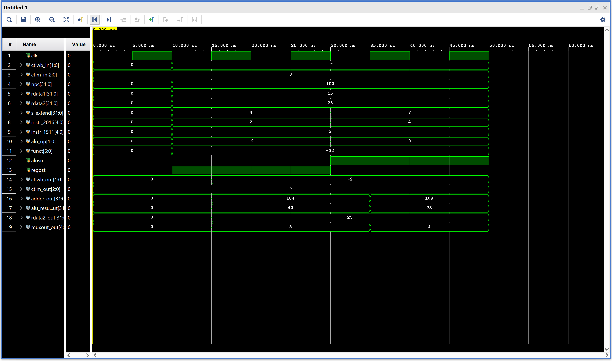

# ECE4300_Execute Pipeline Stage

This repository contains the Verilog design source files and simulation test code for the Execute stage of a MIPS-like processor pipeline.

## Verilog Code Analysis

The design implements the Execute (EX) stage, integrating an Arithmetic Logic Unit (ALU), an adder for branch address calculation, a register destination multiplexer, and an EX/MEM pipeline latch to pass computed values and control signals to the next stage.

### Key Components

- **`execute.v`**: The main top-level module connecting all the components in the Execute stage.
- **`adder.v`**: Computes the branch target address (`npc_plus_offset`), adding the next PC and the sign-extended immediate offset.
- **`alu.v` & `alu_control.v`**: Perform arithmetic operations like ADD and LW address calculation based on the `alu_op` and `funct` fields. 
- **`bottom_mux.v`**: Chooses the destination register (`rd` or `rt`) depending on the `regdst` control signal.
- **`ex_mem.v`**: Pipeline registers capturing and synchronizing signals out of the Execute stage.

## Testbench Test Cases

The testbench (`executeTB.v`) validates the Execute stage's core functionalities by simulating an R-type and I-type instruction.

### Test Case 1: R-Type ADD Instruction (`ADD $3, $1, $2`)
In this test case, the execute stage is verified for a register-to-register addition.
- **Input values**: `$rs` (`rdata1`) holds the value `15`, and `$rt` (`rdata2`) holds the value `25`.
- **Destination Register**: Controlled by `regdst = 1` and `instr_1511` to select the `$rd` address (`5'd3`).
- **ALU Setup**: `alu_op = 2'b10`, `funct = 6'b100000` configure the ALU for addition. `alusrc = 0` sets the second ALU input to the `$rt` register content (`rdata2`).
- **Expected Result**: The ALU computes `15 + 25 = 40`, driving `alu_result_out`. The `ex_mem` latch transfers this payload to the Memory stage.

### Test Case 2: I-Type LW Instruction (`LW $4, 8($1)`)
This test case targets base+offset memory address calculation typical of a Load Word operation.
- **Addressing Address Calculation**: `$rs` holds the base address while `s_extend` holds the offset (`8`).
- **Instruction specific signals**: `alusrc = 1` forces the ALU to take the 32-bit sign-extended immediate (`s_extend = 8`) instead of the register value. `alu_op = 2'b00` directs the ALU to perform addition for memory location calculation.
- **Destination Register**: Set by `regdst = 0`, selecting `instr_2016` (`$rt` register `5'd4`) to store the loaded data downstream.
- **Expected Result**: The final address is resolved, passing correctly along with the value needed to store data onto `alu_result_out`.

## Simulation Timing Diagram

